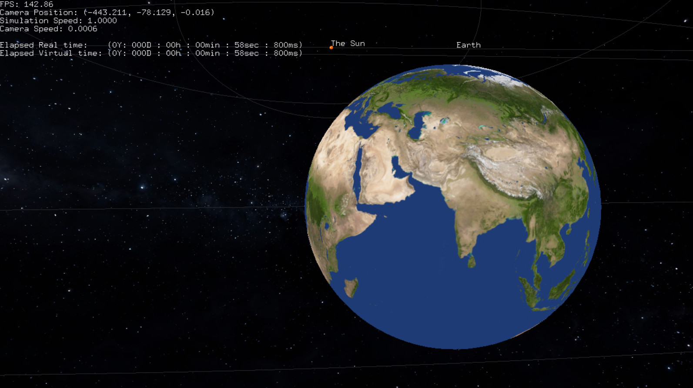
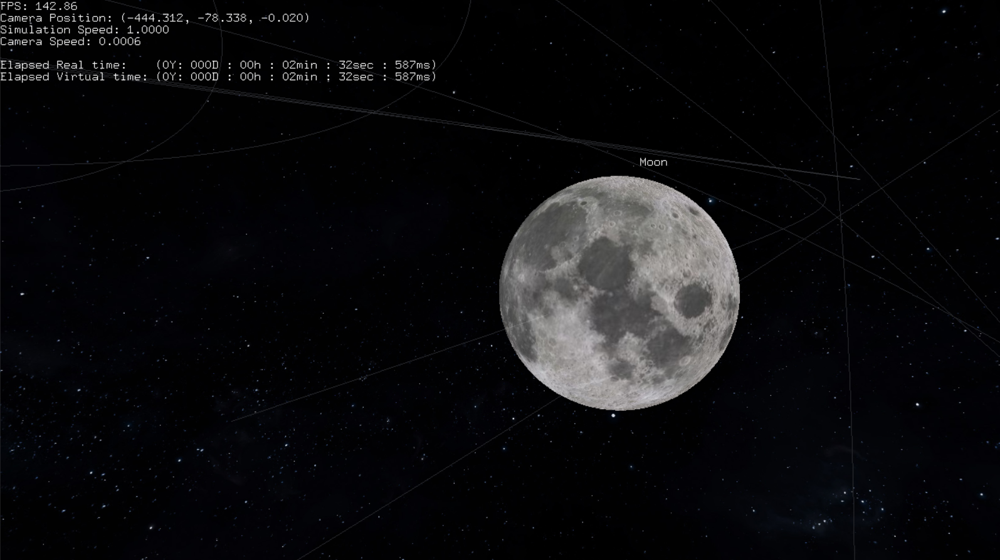
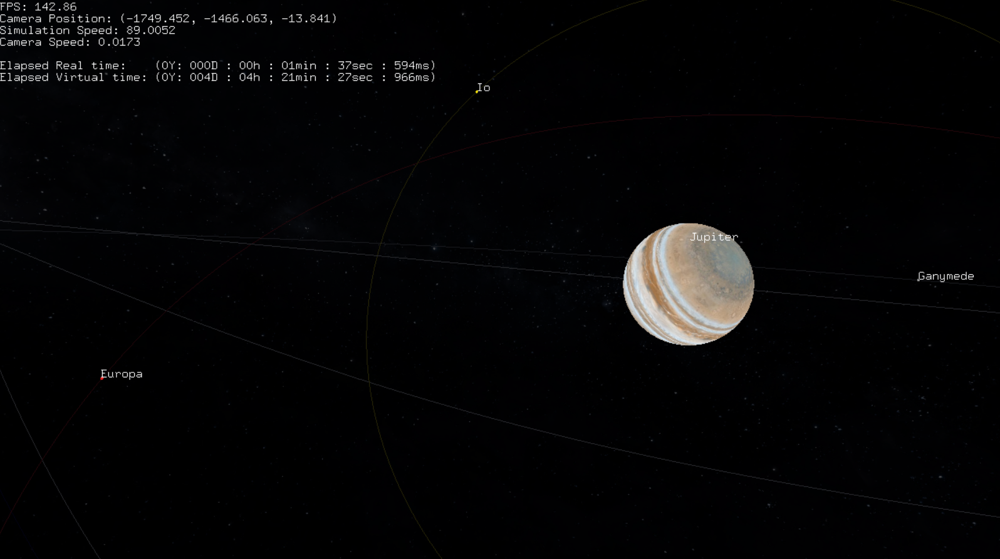
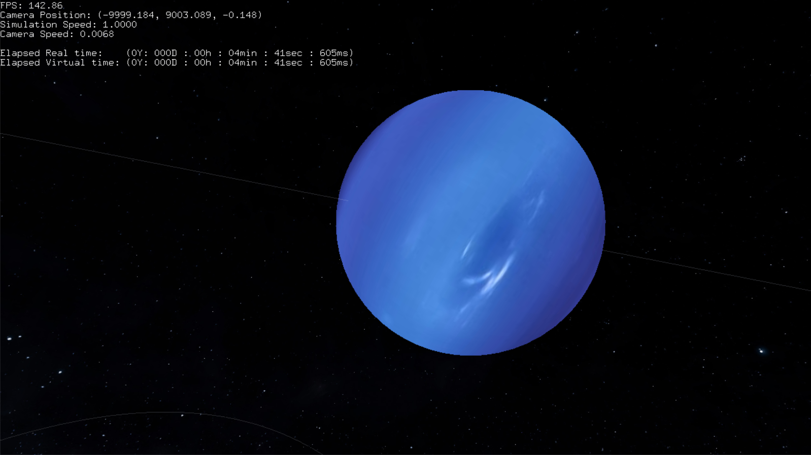

# OpenGL implementation of the Solar System

## Preface

3D simulation of the Copernican astronomical model. The radii and distances of astronomical objects are to scale. Implemented using Python3, C, FreeGLUT and cJSON.

<p align="middle">
    
    
    <br>
    <i> Previews of the rendered scene as the camera slowly moves away and the Sun's rotation. </i>
</p>

<br>

<p align="middle">
    
    
    <br>
    
    
    <br>
    <i> Sample screenshots from the Simulation; Many thanks to <a href="https://www.solarsystemscope.com/textures/">Solar System Scope</a> for the textures.</i>
</p>

<br>

---

## Contents

1. [System Requirements](#system-requirements)

2. [Setup](#setup)

3. [Implementation](#implementation)

    1. [JSON data](#i-json-data)

    2. [Dependencies](#ii-dependencies)

        1. [cJSON](#cjson)

        2. [FreeGLUT](#freeglut)

    3. [Build Automation](#iii-build-automation)

    4. [Interaction](#iv-interaction)

    5. [Classes](#v-classes)

        1. [CustomTypes](#customtypes)

        2. [StellarObject](#stellarobject)

        3. [Camera](#camera)

        4. [AmbientStars](#ambientstars)

        5. [MenuScreen](#menuscreen)

        6. [TextRendering](#textrendering)

        7. [HeadsUpDisplay](#headsupdisplay)

        8. [Timer](#timer)


<br>

---

## System Requirements

This project demands the existence of a base **Python3** interpeter, **CMake ver >3.1** and a C compiler. In the future the project will be supported for different C compilers and operating systems (Windows, Linux, MacOS). However, for the time being support is available only on machines with **MS Windows OS** and the **MSVC compiler**.

<br>

---

## Setup

1. Clone the repository:
    ```
    git clone https://github.com/DimYfantidis/my_solar_system.git
    ```

2. Check for and install any missing Python module dependencies:
    ```
    pip install --exists-action=i -r pydepend.txt
    ```

3. Within the repo's directory, paste the command:
    ``` 
    python setup.py -build-depend -build-proj -run /planets:the_solar_system
    ```
    The `setup.py` script automatically creates and handle's the project's file structure, downloads and compiles [dependencies](#ii-dependencies), links them to the project, compiles the project and executes the generated executable with the `/planets:*` command line argument.

    For more information on the build automation python script, refer to the [Build Automation](#iii-build-automation) subsection or type (within the repo's dir):
    ```
    python setup.py -help
    ```

<br>

---


## Implementation

### I. JSON data

All the simulation's data are loaded from external JSON files, found within the `./data` directory. Two JSON files are loaded and parsed, i.e. `constants.json` and any other JSON file with astronomical data.

The user is encouraged to manipulate `constants.json`'s data to fit their preferences. Currently, it is is expected to have the following structure:

```json
{
    "window_dimensions" : {
        "width" : <int_value>,
        "height" : <int_value>
    },

    "fullscreen" : <boolean_value>,

    "sky_texture" : <boolean_value>,

    "framerate" : <float_value>
}
```

The second JSON file that contains the astronomical system's data (e.g. `./data/the_solar_system/data.json`) is expected to comprise of a single array of objects under the **"Astronomical Objects"** key. The array's elements specify each astronomical object found within the system, as well as its parameters which are:
* `name`
* `radius` (AU)
* `orbit_period` (days)
* `lin_velocity` (AU/h)
* `parent`
* `parent_dist` (AU),
* `solar_tilt` (deg)
* `day_period` (h)
* `color`.

For more information on those fields, refer to the [StellarObject class](#stellarobject).


**Note:** The simulation data should not be confused with user input data. While "simulation data" are also input data, the term "user input" refers to keyboard and mouse input for interacting with the simulation.

<br>

### II. Dependencies

#### cJSON

[cJSON](https://github.com/DaveGamble/cJSON) is an open-source ultra-lightweight JSON parser in ANSI C. It is used for parsing the JSON files found under the `./data` directory.

#### FreeGLUT

[FreeGLUT](https://github.com/freeglut/freeglut) is a free and open-source implementation of the OpenGL Utility Toolkit (GLUT). It is used for managing windows, rendering the 3D world and interacting with it. For more information on interaction, i.e. user input, read [Interaction](#iv-interaction).

<br>

### III. Build Automation

The [setup.py](./setup.py) script is designed to automate the project's **building** and **execution**, the **downloading**, **building** and **linking** of external dependencies, as well as the proper **formatting** of input data and folder structure; all with the use of its simple command line arguments.

* **Dependencies:** The dependencies mentioned in the [previous section](#ii-dependencies) do not come along with the project in the form of pre-compiled binaries. On the contrary, the project's file structure is dynamically changed as they are downloaded from their respective github repos. The script then automatically compiles, builds and links them to the core project through designated shell commands.

* **Data Formatting:** Textures are converted automatically from JPEG format to BMP format using the [Pillow](https://pypi.org/project/pillow/) module. This is more profitable than either storing them as in BMP format online or creating/integrating a custom implementation for parsing JPEG data.

    The textures are saved in JPEG format under `./data/*/` for efficiency, but creating a custom implementation for parsing JPEG images in C is a very complicated process. Also, integrating a custom implementation just introduces unecessary dependencies, and thus complexity to the project. On the other hand, an implementation for loading bitmap images was relatively straightforward to implement, but images are not stored in BMP format due to their large size. Thus, the Pillow module serves to strike a balance between the two options in this scenario.

* **Program Building/Running:** As mentioned in the [Setup](#setup) section, the script serves as a wrapper for the main program, managing the building and running process, as well as specifying the program's input data through designated terminal arguments.

<br>


### IV. Interaction

* **Camera Movement (available on free-fly mode):** `W`/`S` keys (hold) for moving forwards/backwards along the camera's orientation vector; `A`/`D` keys (hold) for moving along the camera's left/right torso vector; `X`/`SPACE` keys (hold) for moving vertically up/down along the y axis.

* **Camera Orientation:** Mouse movement.

* **Camera Speed:** Roll mousewheel Up/Down to increase/decrease camera movement speed.

* **Heads-Up Display:** `H` key (trigger) for opening and closing the HUD which lists diagnostic information about time, position, etc.

* **Menus:** `P` key (trigger) for opening and closing the planets' menu; `ESC` key (trigger) for opening and closing the main menu; Up/Down arrow keys for navigating the menus' options; `ENTER` key for selecting the current menu option.

    * **Planet Menu:** Lists the names of all loaded astronomical objects. By pressing `ENTER` on an object's name, the camera enters its *locked* mode and follows the chosen astronomical object along its trajectory at a fixed distance from it.

    * **Main Menu:** Lists different options such as *free-fly* mode which unlocks the camera from the chosen astronomical object, and *Exit* which terminates the program.

<br>

### V. Classes

This subsection provides an extended explanation of the program's modules of implementation that are found within the `./include` directory. For in-depth analysis of the modules' implementation, feel free to take a look within the designated header files' source code.

<a id="customtypes"></a>

* `CustomTypes.h`: This header file includes definitions of custom types (e.g. vector types, `byte_t`, etc.) and certain utility functions. "Utility functions" is an umbrella term for functions that offer essential high-level abstraction routines that C does not offer by itself. Some of these include string functions like `strBuild` and `strCar`, `vectorLength*` functions, `openBrowserAt` for opening external hyperlinks to the web browser.


<a id="stellarobject"></a>

* `StellarObject.h`:


<a id="camera"></a>

* `Camera.h`: Functions as a high-level API for managing the first-person player view and its variations based on user input. Encapsulates low-level OpenGL API code such as the manipulation of the projection matrix through `gluPerspective` and `gluLookAt`, and manipulating the camera's position and orientation using appropriate conditionals. 


<a id="ambientstars"></a>

* `AmbientStars.h`:


<a id="menuscreen"></a>

* `MenuScreen.h`:


<a id="textrendering"></a>

* `TextRendering`:


<a id="headsupdisplay"></a>

* `HeadsUpDisplay.h`:


<a id="timer"></a>

* `Timer.h`:
